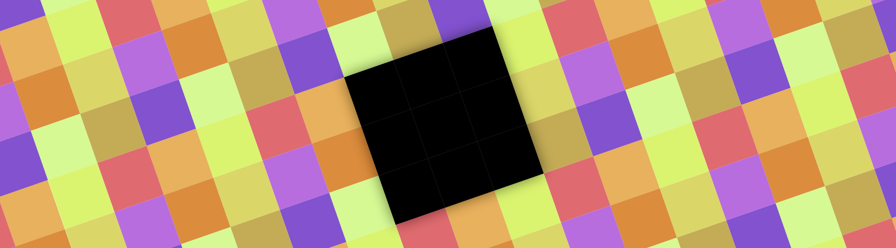

[](https://travis-ci.org/natario1/ZoomLayout)
[](https://github.com/natario1/ZoomLayout/releases)
[](https://github.com/natario1/ZoomLayout/issues)

&#10240;  <!-- Hack to add whitespace -->

<p align="center">
  
</p>

*Need support, consulting, or have any other business-related question? Feel free to <a href="mailto:mat.iavarone@gmail.com">get in touch</a>.*

*Like the project, make profit from it, or simply want to thank back? Please consider [sponsoring](https://github.com/sponsors/natario1)!*

# ZoomLayout & ZoomEngine

Flexible utilities to control and animate zoom and translation of Views and much more - either
programmatically or through touch events.

```groovy
implementation 'com.otaliastudios:zoomlayout:1.7.0'
```

&#10240;  <!-- Hack to add whitespace -->

<p>
  
  
</p>

&#10240;  <!-- Hack to add whitespace -->

You can see `ZoomLayout` in action through our demo app, or if you're curious, in 
[ViewPrinter](https://github.com/natario1/ViewPrinter), a printing library heavily based on this.

## Features

- [`ZoomLayout`](#zoomlayout) : a container that supports 2D pan and zoom to a View hierarchy, even supporting clicks.
- [`ZoomImageView`](#zoomimageview) : (yet another) ImageView that supports 2D pan and zoom.
- [`ZoomSurfaceView`](#zoomsurfaceview) : A SurfaceView that supports 2D pan and zoom with OpenGL rendering (API 18).
- Lightweight, no dependencies
- API 16

In fact, `ZoomLayout`, `ZoomImageView` and `ZoomSurfaceView` are just very simple implementations of the
internal [`ZoomEngine`](#zoomengine). The zoom engine lets you animate everything through
constant updates, as long as you feed it with touch events, with a `Matrix`-based mechanism
that makes it very flexible.


## ZoomEngine

The low-level engine offers a `Matrix`-based stream of updates, as long as it is fed
with touch events and knows the dimensions of your content.

There is no strict limit over what you can do with a `Matrix`,

- move `Canvas` objects around
- transform `View` hierarchies
- apply to `ImageView`s or `Bitmap`
- transform `MotionEvent`s
- probably more

### Direct usage

If you are interested in using the engine directly, I encourage you to take a look at the `ZoomLayout`
or `ZoomImageView` implementations. It is extremely simple. Basically:

- You construct a `ZoomEngine` passing the `View` that acts as a container for your content
- As soon as you know it (and whenever it changes), you pass the *content* dimensions using `setContentSize(float, float)`
- As soon as you receive them, you pass touch updates to `onInterceptTouchEvent` or `onTouchEvent`
- Any `ZoomEngine.Listener` subscribed will be passed `Matrix` updates

|API|Description|
|---|-----------|
|`setContentSize(float, float)`|Sets the size of the content, whatever it is.|
|`onTouchEvent(MotionEvent)`|Should be called to feed the engine with new events.|
|`onInterceptTouchEvent(MotionEvent)`|Should be called to feed the engine with new events.|
|`setContainerSize(float, float)`|Updates the container size. This is generally not needed. The engine will get the container dimensions using a OnGlobalLayout listener. However, in some cases, you might want to trigger this directly.|

The size methods will also accept a boolean indicating whether the engine should re-apply the transformation.
The transformation is always applied if the engine is in its starting state.

## Contributions

You are welcome to contribute with suggestions or pull requests.
I don't plan to add lots of features (specifically, I don't plan to have `ZoomImageView`
compete with similar libraries that already do this very well), the plan is to keep
this lightweight. But I welcome well-thought contributions.
