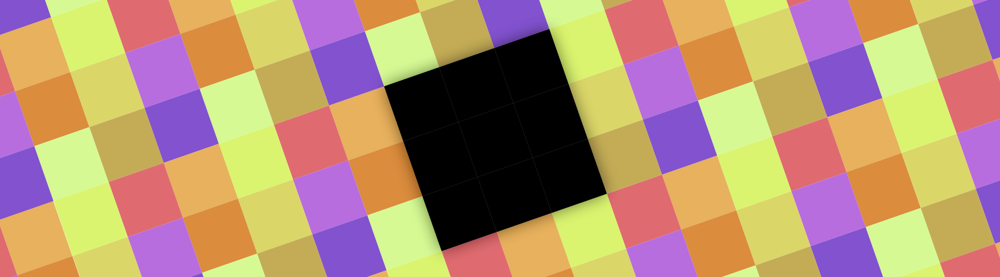

[](https://github.com/natario1/ZoomLayout/actions)
[](https://github.com/natario1/ZoomLayout/releases)
[](https://github.com/natario1/ZoomLayout/issues)

&#10240;  <!-- Hack to add whitespace -->

<p align="center">
  
</p>

*Need support, consulting, or have any other business-related question? Feel free to <a href="mailto:mat.iavarone@gmail.com">get in touch</a>.*

*Like the project, make profit from it, or simply want to thank back? Please consider [sponsoring](https://github.com/sponsors/natario1)!*

# ZoomLayout

A collection of flexible Android components that support zooming and panning of View hierarchies, 
images, video streams, and much more - either programmatically or through touch events.

```kotlin
implementation("com.otaliastudios:zoomlayout:1.9.0")
```

- `ZoomLayout`: a container that supports 2D pan and zoom to a View hierarchy, even supporting clicks [[docs]](https://natario1.github.io/ZoomLayout/docs/zoom-layout)
- `ZoomImageView`: (yet another) ImageView that supports 2D pan and zoom [[docs]](https://natario1.github.io/ZoomLayout/docs/zoom-image)
- `ZoomSurfaceView`: A SurfaceView that supports 2D pan and zoom with OpenGL rendering [[docs]](https://natario1.github.io/ZoomLayout/docs/zoom-surface)
- Powerful zoom APIs [[docs]](https://natario1.github.io/ZoomLayout/docs/zoom-apis)
- Powerful pan APIs [[docs]](https://natario1.github.io/ZoomLayout/docs/pan-apis)
- Lightweight, no dependencies
- Works down to API 16

In fact, `ZoomLayout`, `ZoomImageView` and `ZoomSurfaceView` are just very simple implementations of the
internal `ZoomEngine` [[docs]](https://natario1.github.io/ZoomLayout/docs/zoom-engine). The zoom engine lets you animate everything through
constant updates, as long as you feed it with touch events, with a `Matrix`-based mechanism
that makes it very flexible.

&#10240;  <!-- Hack to add whitespace -->

<p align="center">
  
</p>

&#10240;  <!-- Hack to add whitespace -->


## Support

If you like the project, make profit from it, or simply want to thank back, please consider 
[supporting it](https://github.com/natario1/ZoomLayout/issues/125) through the GitHub Sponsors program! 
You can have your company logo here, get private support hours or simply help me push this forward. 

Feel free to <a href="mailto:mat.iavarone@gmail.com">contact me</a> for support, consulting or any 
other business-related question.

## Setup

Please read the [official website](https://natario1.github.io/ZoomLayout) for setup instructions and documentation.
You might also be interested in our [changelog](https://natario1.github.io/ZoomLayout/about/changelog). 

```xml
<com.otaliastudios.zoom.ZoomLayout
    android:layout_width="match_parent"
    android:layout_height="match_parent"
    android:scrollbars="vertical|horizontal"   
    app:transformation="centerInside"                                
    app:transformationGravity="auto"
    app:alignment="center"
    app:overScrollHorizontal="true"
    app:overScrollVertical="true"
    app:overPinchable="true"
    app:horizontalPanEnabled="true"
    app:verticalPanEnabled="true"
    app:zoomEnabled="true"
    app:flingEnabled="true"
    app:scrollEnabled="true"
    app:oneFingerScrollEnabled="true"
    app:twoFingersScrollEnabled="true"
    app:threeFingersScrollEnabled="true"
    app:minZoom="0.7"
    app:minZoomType="zoom"
    app:maxZoom="2.5"
    app:maxZoomType="zoom"
    app:animationDuration="280"
    app:hasClickableChildren="false">

    <!-- Content here. -->

</com.otaliastudios.zoom.ZoomLayout>
```
