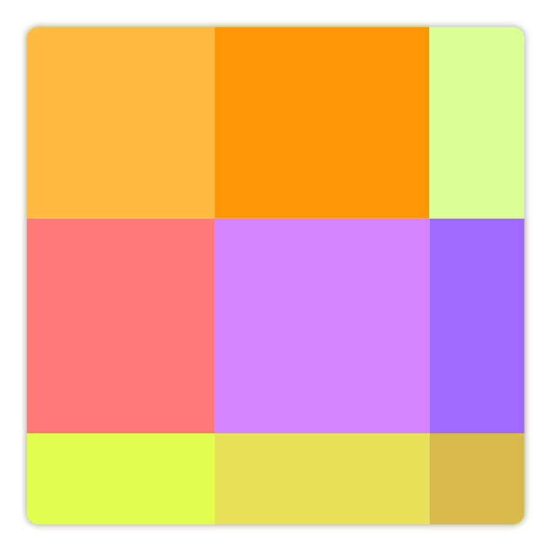

[](https://travis-ci.org/natario1/ZoomLayout)

<p align="center">
  
</p>

# ZoomLayout & ZoomEngine

Flexible utilities to control and animate zoom and translation of Views and much more - either
programmatically or through touch events.

```groovy
implementation 'com.otaliastudios:zoomlayout:1.5.0'
```

<p>
  
  
</p>

*Want to see `ZoomLayout` in action? Try the demo app or take a look at [ViewPrinter](https://github.com/natario1/ViewPrinter), a printing library heavily based on this.*

## Features

- [`ZoomLayout`](#zoomlayout) : a container that supports 2D pan and zoom to a View hierarchy, even supporting clicks.
- [`ZoomImageView`](#zoomimageview) : (yet another) ImageView that supports 2D pan and zoom.
- Lightweight, no dependencies
- API 16

In fact, both `ZoomLayout` and `ZoomImageView` are just very simple implementations of the
internal [`ZoomEngine`](#zoomengine). The zoom engine lets you animate everything through
constant updates, as long as you feed it with touch events, with a `Matrix`-based mechanism
that makes it very flexible.

## ZoomLayout

A container for view hierarchies that can be panned or zoomed.

```xml
<com.otaliastudios.zoom.ZoomLayout
    android:layout_width="match_parent"
    android:layout_height="match_parent"
    android:scrollbars="vertical|horizontal"   
    app:transformation="centerInside"                                
    app:transformationGravity="auto"
    app:alignment="center"
    app:overScrollHorizontal="true"
    app:overScrollVertical="true"
    app:overPinchable="true"
    app:horizontalPanEnabled="true"
    app:verticalPanEnabled="true"
    app:zoomEnabled="true"
    app:flingEnabled="true"
    app:minZoom="0.7"
    app:minZoomType="zoom"
    app:maxZoom="2.5"
    app:maxZoomType="zoom"
    app:animationDuration="280"
    app:hasClickableChildren="false">

    <!-- Content here. -->

</com.otaliastudios.zoom.ZoomLayout>
```
    
### Children
    
ZoomLayout supports only a single child, but that child can have as many children as you wish.
If any of these children is clickable or should react to touch events, you are required to set
`hasClickableChildren` to true. This is off by default because it is more expensive in terms of performance.

The child view will be measured as wrap content with no limits in space, as in a 2D scroll view.
So it can be as big as you want.

### APIs

The zoom layout will forward all API calls to the internal engine. See [engine docs](#zoomengine).
You can also get the backing engine using `zoomLayout.getEngine()`.

```java
zoomLayout.panTo(x, y, true); // Shorthand for zoomLayout.getEngine().panTo(x, y, true)
zoomLayout.panBy(deltaX, deltaY, true);
zoomLayout.zoomTo(zoom, true);
zoomLayout.zoomBy(factor, true);
zoomLayout.realZoomTo(realZoom, true);
zoomLayout.moveTo(zoom, x, y, true);
```

## ZoomImageView

An `ImageView` implementation to control pan and zoom over its Drawable or Bitmap.

```xml
<com.otaliastudios.zoom.ZoomImageView
    android:layout_width="match_parent"
    android:layout_height="match_parent"
    android:scrollbars="vertical|horizontal"  
    app:transformation="centerInside"    
    app:transformationGravity="auto"  
    app:alignment="center"                                                                                                                        
    app:overScrollHorizontal="true"
    app:overScrollVertical="true"
    app:overPinchable="true"
    app:horizontalPanEnabled="true"
    app:verticalPanEnabled="true"
    app:zoomEnabled="true"
    app:flingEnabled="true"
    app:minZoom="0.7"
    app:minZoomType="zoom"
    app:maxZoom="2.5"
    app:maxZoomType="zoom"
    app:animationDuration="280"/>
```

There is nothing surprising going on. Just call `setImageDrawable()` and you are done.

Presumably ZoomImageView **won't** work if:

- the drawable has no intrinsic dimensions (like a ColorDrawable)
- the view has wrap_content as a dimension
- you change the scaleType (read [later](#zoom) to know more)

There are lots of libraries on this topic and this is not necessarily *better*, yet it is
a natural implementations of the zoom engine. It is fast, lightweight and simple.
    
### APIs

The zoom image view will forward all API calls to the internal engine. See [engine docs](#zoomengine).
You can also get the backing engine using `zoomImageView.getEngine()`.

```java
zoomImageView.panTo(x, y, true); // Shorthand for zoomImageView.getEngine().panTo(x, y, true)
zoomImageView.panBy(deltaX, deltaY, true);
zoomImageView.zoomTo(zoom, true);
zoomImageView.zoomBy(factor, true);
zoomImageView.realZoomTo(realZoom, true);
zoomImageView.moveTo(zoom, x, y, true);
```

## ZoomEngine

The low-level engine offers a `Matrix`-based stream of updates, as long as it is fed
with touch events and knows the dimensions of your content.

There is no strict limit over what you can do with a `Matrix`,

- move `Canvas` objects around
- transform `View` hierarchies
- apply to `ImageView`s or `Bitmap`
- transform `MotionEvent`s
- probably more

### Zoom

#### Transformation

The transformation defines the engine **resting position**. It is a keyframe that is reached at
certain points, like at start-up or when explicitly requested through `setContentSize` or `setContainerSize`.

The keyframe is defined by two elements: 

- a `transformation` value (modifies zoom in a certain way)
- a `transformationGravity` value (modifies pan in a certain way)

which can be controlled through `setTransformation(int, int)` or `app:transformation` and `app:transformationGravity`.

|Transformation|Description|
|--------------|-----------|
|`centerInside`|The content is scaled down or up so that it fits completely inside the view bounds.|
|`centerCrop`|The content is scaled down or up so that its smaller side fits exactly inside the view bounds. The larger side will be cropped.|
|`none`|No transformation is applied.|

After transformation is applied, the transformation gravity will reposition the content with
the specified value. Supported values are most of the `android.view.Gravity` flags like `Gravity.TOP`, plus `TRANSFORMATION_GRAVITY_AUTO`.

|Transformation Gravity|Description|
|----------------------|-----------|
|`top`, ...|The content is panned so that its *top* side matches teh container *top* side. Same for other values.|
|`auto` (default)|The transformation gravity is taken from the engine [alignment](#alignment), defaults to `center` on both axes.|

**Note: after transformation and gravity are applied, the engine will apply - as always - all the active constraints,
including minZoom, maxZoom, alignment. This means that the final position might be slightly (or completely) different.**

For example, when `maxZoom == 1`, the content is forced to not be any larger than the container. This means that
a `centerCrop` transformation will not have the desired effect: it will act just like a `centerInside`.

#### Alignment

You can force the content position with respect to the container using the `setAlignment(int)` method
or the `alignment` XML flag of `ZoomLayout` and `ZoomImageView`. 
The default value is `Alignment.CENTER` which will center the content on both directions.

**Note: alignment does not make sense when content is larger than the container, because forcing an 
alignment (e.g. left) would mean making part of the content unreachable (e.g. the right part).**

|Alignment|Description|
|---------|-----------|
|`top`, `bottom`, `left`, `right`|Force align the content to the same side of the container.|
|`center_horizontal`, `center_vertical`|Force the content to be centered inside the container on that axis.|
|`none_horizontal`, `none_vertical`|No alignment set: content is free to be moved on that axis.|

You can use the `or` operation to mix the vertical and horizontal flags:

```kotlin
engine.setAlignment(Alignment.TOP or Alignment.LEFT)
engine.setAlignment(Alignment.TOP) // Equals to Aligment.TOP or Alignment.NONE_HORIZONTAL
engine.setAlignment(Alignment.NONE) // Remove any forced alignment
```

#### Zoom Types

The base transformation makes the difference between **zoom** and **realZoom**. Since we have silently applied
a base zoom to the content, we must introduce two separate types:

|Zoom type|Value|Description|
|---------|-----|-----------|
|Zoom|`TYPE_ZOOM`|The scale value after the initial transformation. `zoom == 1` means that the content was untouched after the transformation.|
|Real zoom|`TYPE_REAL_ZOOM`|The actual scale value, including the initial transformation. `realZoom == 1` means that the 1 inch of the content fits 1 inch of the screen.|

To make things clearer, when transformation is `none`, the zoom and the real zoom will be identical.
The distinction is very useful when it comes to imposing min and max constraints to our zoom value.

Note that these values will change if the `setContentSize` or `setContainerSize` APIs are used
with `applyTransformation = true`.

#### APIs

Some of the zoom APIs will let you pass an integer (either `TYPE_ZOOM` or `TYPE_REAL_ZOOM`)
to define the zoom type you are referencing to. Depending on the context, imposing restrictions on one type
will make more sense than the other - e. g., in a PDF viewer, you might want to cap real zoom at `1`.

|API|Description|Default value|
|---|-----------|-------------|
|`getZoom()`|Returns the current zoom, not taking into account the base scale.|`1`|
|`getRealZoom()`|Returns the current zoom taking into account the base scale. This is the matrix scale.|`-`|
|`setMinZoom(float, @ZoomType int)`|Sets the lower bound when pinching out.|`0.8`, `TYPE_ZOOM`|
|`setMaxZoom(float, @ZoomType int)`|Sets the upper bound when pinching in.|`2.5`, `TYPE_REAL_ZOOM`|
|`setOverPinchable(boolean)`|If true, the content will be allowed to zoom outside its bounds, then return to its position.|`true`|
|`realZoomTo(float, boolean)`|Moves the real zoom to the given value, animating if needed.|`-`|
|`zoomTo(float, boolean)`|Moves the zoom to the given value, animating if needed.|`-`|
|`zoomBy(float, boolean)`|Applies the given factor to the current zoom, animating if needed. OK for both types.|`-`|
|`zoomIn()`|Applies a small, animated zoom-in.|`-`|
|`zoomOut()`|Applies a small, animated zoom-out.|`-`|
|`setZoomEnabled(boolean)`|If true, the content will be allowed to zoom in and out by user input.|`true`|

The `moveTo(float, float, float, boolean)` API will let you animate both zoom and [pan](#pan) at the same time.

### Pan

All pan APIs accept x and y coordinates. These refer to the top-left visible pixel of the content.

- If using `ZoomLayout`, the coordinate system is that of the inner view
- If using `ZoomImageView`, the coordinate system is that of the drawable intrinsic width and height
- If using the engine directly, the coordinate system is that of the rect you passed in `setContentRect`

In any case the current scale is not considered, so your system won't change if zoom changes.

|API|Description|Default value|
|---|-----------|-------------|
|`getPanX()`|Returns the current horizontal pan.|`-`|
|`getPanY()`|Returns the current vertical pan.|`-`|
|`setOverScrollHorizontal(boolean)`|If true, the content will be allowed to pan outside its horizontal bounds, then return to its position.|`true`|
|`setOverScrollVertical(boolean)`|If true, the content will be allowed to pan outside its vertical bounds, then return to its position.|`true`|
|`setHorizontalPanEnabled(boolean)`|If true, the content will be allowed to pan **horizontally** by user input.|`true`|
|`setVerticalPanEnabled(boolean)`|If true, the content will be allowed to pan **vertically** by user input.|`true`|
|`setFlingEnabled(boolean)`|If true, fling gestures will be detected.|`true`|
|`setAllowFlingInOverscroll(boolean)`|If true, fling gestures will be allowed even when detected while overscrolled. This might cause artifacts so it is disabled by default.|`false`|
|`panTo(float, float, boolean)`|Pans to the given values, animating if needed.|`-`|
|`panBy(float, float, boolean)`|Applies the given deltas to the current pan, animating if needed.|`-`|

The `moveTo(float, float, float, boolean)` API will let you animate both [zoom](#zoom) and pan at the same time.

**Note:**
To pan the content of a ZoomLayout to the right you must move it to the left - so depending on the situtation you might need to pass in negative coordinates to `panTo` or `moveTo` for the desired outcome.
</aside>

### Direct usage

If you are interested in using the engine directly, I encourage you to take a look at the `ZoomLayout`
or `ZoomImageView` implementations. It is extremely simple. Basically:

- You construct a `ZoomEngine` passing the `View` that acts as a container for your content
- As soon as you know it (and whenever it changes), you pass the *content* dimensions using `setContentSize(float, float)`
- As soon as you receive them, you pass touch updates to `onInterceptTouchEvent` or `onTouchEvent`
- Any `ZoomEngine.Listener` subscribed will be passed `Matrix` updates

|API|Description|
|---|-----------|
|`setContentSize(float, float)`|Sets the size of the content, whatever it is.|
|`onTouchEvent(MotionEvent)`|Should be called to feed the engine with new events.|
|`onInterceptTouchEvent(MotionEvent)`|Should be called to feed the engine with new events.|
|`setContainerSize(float, float)`|Updates the container size. This is generally not needed. The engine will get the container dimensions using a OnGlobalLayout listener. However, in some cases, you might want to trigger this directly.|

The size methods will also accept a boolean indicating whether the engine should re-apply the transformation.
The transformation is always applied if the engine is in its starting state.

## Contributions

You are welcome to contribute with suggestions or pull requests.
I don't plan to add lots of features (specifically, I don't plan to have `ZoomImageView`
compete with similar libraries that already do this very well), the plan is to keep
this lightweight. But I welcome well-thought contributions.
